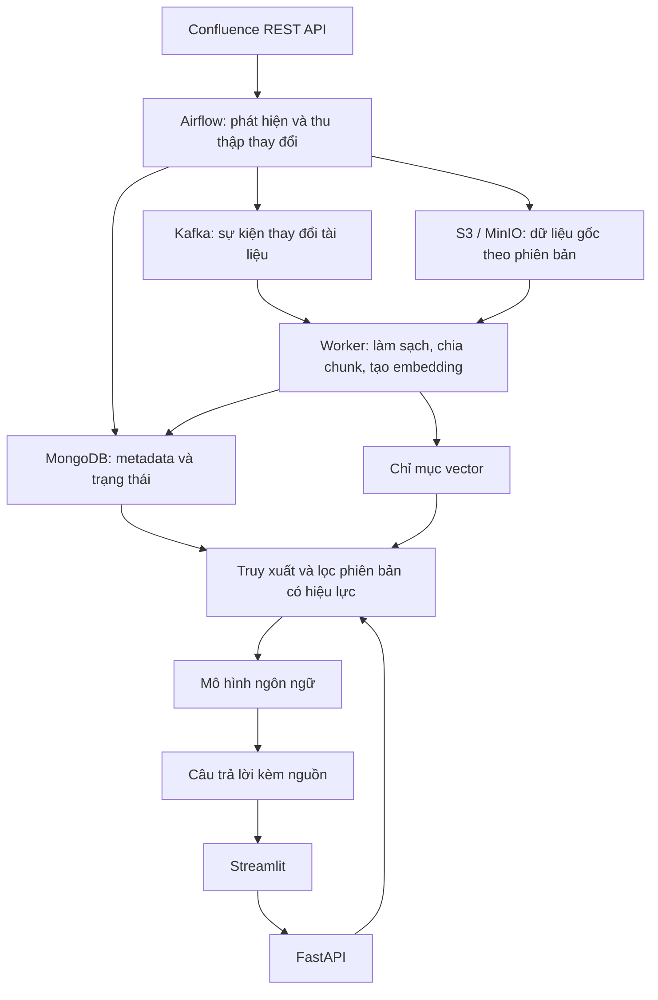

# Phác thảo đồ án tốt nghiệp

## 1. Thông tin đề tài

**Tên đề tài dự kiến:** Nghiên cứu và xây dựng hệ thống kho tri thức doanh nghiệp thông minh từ Confluence.

**Học viên:** Đặng Nam Cường.

**Định hướng:** Kết hợp Data Engineering và AI để xây dựng pipeline đồng bộ tài liệu, quản lý phiên bản và hỗ trợ tìm kiếm, hỏi đáp có dẫn nguồn.

Tài liệu này mô tả hướng triển khai dự kiến. Phạm vi, công nghệ và tiêu chí nghiệm thu sẽ được chốt cùng giảng viên hướng dẫn trước khi triển khai đầy đủ.

## 2. Bài toán và động lực

Tài liệu doanh nghiệp trên Confluence thường xuyên được tạo mới, chỉnh sửa hoặc xóa. Việc khai thác tài liệu bằng hệ thống hỏi đáp đòi hỏi dữ liệu được đồng bộ, nội dung truy xuất có nguồn gốc rõ ràng và các phiên bản cũ không bị sử dụng nhầm.

Đồ án hướng đến xây dựng một kho tri thức có khả năng cập nhật từ Confluence, lưu giữ dữ liệu để tái xử lý và phục vụ hỏi đáp bằng RAG (Retrieval-Augmented Generation). Trọng tâm là quản lý vòng đời dữ liệu từ lúc phát hiện thay đổi đến khi phiên bản mới sẵn sàng cho truy vấn.

Các câu hỏi chính cần giải quyết:

- Làm thế nào để đồng bộ dữ liệu gia tăng và phục hồi sau lỗi mà không bỏ sót hoặc tạo trùng dữ liệu?
- Làm thế nào để cập nhật chỉ mục tìm kiếm mà không trộn nội dung giữa các phiên bản của cùng một tài liệu?
- Làm thế nào để kiểm chứng chất lượng truy xuất, câu trả lời và độ mới của tri thức?

## 3. Mục tiêu

1. Xây dựng pipeline thu thập và đồng bộ gia tăng tài liệu Confluence qua REST API.
2. Lưu trữ dữ liệu gốc, metadata và lịch sử phiên bản để phục vụ truy vết, tái xử lý.
3. Xây dựng cơ chế xử lý sự kiện có retry và tính idempotent, tức chạy lại không tạo kết quả trùng.
4. Làm sạch, chia đoạn và tạo embedding để xây dựng chỉ mục tìm kiếm ngữ nghĩa.
5. Xây dựng chức năng hỏi đáp RAG có dẫn nguồn, chỉ sử dụng phiên bản đang có hiệu lực trong kho tri thức.
6. Đánh giá hiệu quả đồng bộ, tính nhất quán phiên bản và chất lượng hỏi đáp bằng bộ dữ liệu thử nghiệm.

## 4. Phạm vi

### 4.1. Chức năng cốt lõi

- Thu thập các trang thuộc một tập Confluence Space được cấu hình trước.
- Đồng bộ lần đầu và đồng bộ gia tăng theo lịch.
- Phát hiện trang mới, trang cập nhật và xử lý trang bị xóa hoặc không còn được phép truy cập.
- Lưu nội dung gốc trên S3 hoặc MinIO; lưu metadata và trạng thái xử lý trong MongoDB.
- Phát sự kiện thay đổi qua Kafka và xử lý bằng worker.
- Chuẩn hóa nội dung trang, chia chunk và tạo embedding.
- Quản lý phiên bản được phép truy xuất; vô hiệu hóa nội dung hết hiệu lực.
- Tìm kiếm ngữ nghĩa và hỏi đáp RAG có liên kết về tài liệu nguồn.
- Theo dõi trạng thái đồng bộ, lỗi và thao tác xử lý lại.

### 4.2. Chức năng mở rộng

Chỉ triển khai sau khi phần cốt lõi đã được kiểm chứng:

- So sánh và tóm tắt thay đổi giữa các phiên bản tài liệu.
- Daily Knowledge Digest: tổng hợp tài liệu mới và các thay đổi theo ngày.
- Tìm kiếm kết hợp từ khóa và vector; reranking kết quả truy xuất.
- Trích xuất nội dung tệp đính kèm PDF dạng văn bản.
- OCR cho tài liệu ảnh hoặc PDF scan.

Fraud Detection không thuộc phạm vi đề tài vì chưa gắn trực tiếp với bài toán đồng bộ và khai thác kho tri thức.

### 4.3. Giới hạn của bản thử nghiệm

- Sử dụng dữ liệu giả lập hoặc tài liệu công khai được đưa vào Confluence thử nghiệm.
- Ưu tiên nội dung trang dạng văn bản; các định dạng phức tạp được ghi nhận là giới hạn hoặc xử lý ở giai đoạn mở rộng.
- Bản thử nghiệm phục vụ nhóm người dùng có cùng phạm vi quyền truy cập. Phân quyền theo từng người dùng là hướng mở rộng; không đưa tài liệu ngoài phạm vi được phép vào chỉ mục.
- Độ mới của dữ liệu phụ thuộc lịch đồng bộ và thời gian xử lý; không đặt mục tiêu cập nhật thời gian thực.

## 5. Kiến trúc dự kiến

| Thành phần | Vai trò dự kiến |
| --- | --- |
| Confluence | Nguồn tài liệu, định danh trang và thông tin phiên bản |
| Apache Airflow | Lập lịch, phát hiện thay đổi, thu thập dữ liệu và theo dõi lần đồng bộ |
| S3 / MinIO | Lưu dữ liệu gốc theo tài liệu và phiên bản để tái xử lý |
| MongoDB | Lưu metadata, lịch sử phiên bản, trạng thái xử lý và phiên bản đang có hiệu lực |
| Kafka | Chuyển sự kiện từ bước thu thập sang các worker xử lý |
| Worker | Chuẩn hóa văn bản, chia chunk, tạo embedding và cập nhật chỉ mục |
| Chỉ mục vector | Lưu vector và phục vụ tìm kiếm ngữ nghĩa |
| FastAPI | Cung cấp API tìm kiếm, hỏi đáp và theo dõi dữ liệu |
| Streamlit | Giao diện thử nghiệm phục vụ demo và đánh giá |
| Docker Compose | Tổ chức các dịch vụ trên máy phát triển hoặc một máy chủ thử nghiệm |

MongoDB Vector Search là một phương án cho chỉ mục vector. Lựa chọn cuối cùng cần được kiểm chứng về khả năng triển khai, tài nguyên và chi phí trước khi chốt. Mô hình embedding và mô hình ngôn ngữ cũng sẽ được chọn qua thử nghiệm trên dữ liệu của đồ án.

## 6. Thiết kế luồng xử lý

### 6.1. Thu thập và đồng bộ

1. Airflow đọc cấu hình nguồn và mốc đồng bộ đã hoàn tất gần nhất.
2. Lấy danh sách trang cần kiểm tra, xử lý phân trang và đối chiếu phiên bản với metadata đã lưu.
3. Thu thập nội dung trang mới hoặc thay đổi, lưu dữ liệu gốc và ghi nhận trạng thái của phiên bản.
4. Phát sự kiện sang Kafka chứa định danh tài liệu, phiên bản, loại thay đổi và vị trí dữ liệu gốc.
5. Chỉ cập nhật mốc đồng bộ khi bước thu thập hoàn tất và các sự kiện đã được ghi nhận để có thể gửi hoặc gửi lại.

Đồng bộ gia tăng cần kết hợp khoảng thời gian truy vấn chồng lấn và đối soát định kỳ để giảm nguy cơ bỏ sót thay đổi. Trang bị xóa hoặc mất quyền truy cập cần được kiểm tra bằng cơ chế đối soát phù hợp với nguồn, thay vì chỉ dựa vào danh sách trang được cập nhật.

### 6.2. Xử lý và lập chỉ mục

1. Worker nhận sự kiện và kiểm tra phiên bản đã được xử lý hay chưa.
2. Đọc dữ liệu gốc, chuẩn hóa nội dung và giữ cấu trúc tiêu đề, đoạn văn, bảng ở mức hỗ trợ được.
3. Chia nội dung thành chunk, gắn metadata gồm tài liệu, phiên bản, tiêu đề, vị trí và URL nguồn.
4. Tạo embedding và ghi các chunk vào chỉ mục dưới phiên bản chưa được kích hoạt.
5. Kiểm tra kết quả, sau đó chuyển phiên bản có hiệu lực sang phiên bản mới.
6. Loại phiên bản cũ khỏi tập được phép truy xuất; giữ dữ liệu gốc phục vụ lịch sử và tái xử lý.

Trong bản cốt lõi, khi trang thay đổi sẽ xử lý lại toàn bộ nội dung của trang đó. Tái sử dụng embedding cho các phần không đổi là hướng tối ưu sau khi cơ chế phiên bản hoạt động ổn định.

### 6.3. Tính nhất quán phiên bản và xử lý lỗi

- Phân biệt **phiên bản mới nhất đã phát hiện** và **phiên bản đang có hiệu lực trong chỉ mục**.
- Truy xuất chỉ chấp nhận chunk có phiên bản khớp với phiên bản có hiệu lực trong metadata; cần kiểm tra điều kiện này trước khi đưa nội dung vào mô hình ngôn ngữ.
- Chỉ kích hoạt phiên bản mới khi toàn bộ các chunk cần thiết đã được lập chỉ mục thành công.
- Nếu xử lý phiên bản mới thất bại, giữ phiên bản đang có hiệu lực và hiển thị trạng thái chưa cập nhật. Không tuyên bố dữ liệu luôn trùng với Confluence tại thời điểm hỏi.
- Với trang bị xóa hoặc bị thu hồi quyền truy cập, vô hiệu hóa truy xuất ngay sau khi phát hiện.
- Khi sự kiện đến sai thứ tự, phiên bản cũ không được ghi đè phiên bản mới hơn đã kích hoạt.
- Dùng khóa xử lý gồm nguồn, mã tài liệu, phiên bản và phiên bản cấu hình pipeline để hỗ trợ chạy lại an toàn.
- Lưu trạng thái gửi sự kiện và trạng thái xử lý; có cơ chế phục hồi khi dữ liệu đã lưu nhưng sự kiện chưa được gửi thành công.
- Giới hạn retry, ghi nhận lỗi và đưa tác vụ lỗi kéo dài vào danh sách cần xử lý lại.

Một lần đồng bộ thành công ở Airflow chỉ xác nhận bước thu thập. Tài liệu chỉ được coi là sẵn sàng cho hỏi đáp khi worker hoàn tất lập chỉ mục và kích hoạt phiên bản.

### 6.4. Tìm kiếm và hỏi đáp

1. Người dùng nhập từ khóa hoặc câu hỏi.
2. Hệ thống tạo embedding cho câu hỏi và truy xuất các chunk liên quan.
3. Lọc theo phạm vi dữ liệu được phép và phiên bản có hiệu lực.
4. Đưa các đoạn phù hợp vào mô hình ngôn ngữ để tạo câu trả lời.
5. Hiển thị câu trả lời cùng tên tài liệu, URL và phiên bản nguồn.
6. Khi dữ liệu không đủ để trả lời, thông báo thiếu căn cứ thay vì yêu cầu mô hình suy đoán.

## 7. Dữ liệu và bảo mật

- Bộ dữ liệu thử nghiệm gồm các trang có tiêu đề, nội dung, cấu trúc phân cấp và lịch sử cập nhật do người thực hiện kiểm soát.
- Thiết kế các tình huống tạo mới, sửa nội dung, xóa trang, mất quyền truy cập và lỗi xử lý.
- API token, thông tin truy cập lưu trữ và khóa dịch vụ AI được quản lý qua biến môi trường, Airflow Connections hoặc cơ chế secret phù hợp; không ghi trực tiếp vào mã nguồn.
- Không ghi thông tin bí mật vào log hoặc đưa dữ liệu ngoài phạm vi cho phép đến dịch vụ AI.
- Nội dung tài liệu được xem là dữ liệu tham khảo; không được dùng để thay đổi quy tắc hệ thống hoặc quyền truy cập.

## 8. Phương pháp đánh giá

### 8.1. Thiết lập thử nghiệm

Xây dựng bộ tài liệu và bộ câu hỏi kiểm thử có nguồn đáp án xác định. Bộ câu hỏi cần bao gồm câu hỏi có đáp án, câu hỏi không có đủ dữ liệu và câu hỏi mà đáp án thay đổi sau khi cập nhật tài liệu.

Quy mô dữ liệu, số câu hỏi và ngưỡng nghiệm thu sẽ được xác định sau thử nghiệm ban đầu, ghi rõ trong báo cáo và giữ thống nhất khi so sánh các phương án.

| Nhóm đánh giá | Cách kiểm chứng |
| --- | --- |
| Hiệu quả đồng bộ | So sánh đồng bộ toàn bộ và gia tăng trên cùng bộ dữ liệu: thời gian, số yêu cầu API, lượng dữ liệu xử lý và số chunk cần tạo embedding |
| Độ mới của tri thức | Đo thời gian từ lúc thay đổi trên Confluence đến lúc phiên bản mới truy xuất được |
| Tính nhất quán phiên bản | Kiểm tra không đưa chunk hết hiệu lực vào ngữ cảnh trả lời sau khi kích hoạt phiên bản mới |
| Khả năng phục hồi | Gửi lại sự kiện, chạy lại job, làm lỗi một bước và kiểm tra không tạo trùng hoặc kích hoạt phiên bản chưa hoàn tất |
| Chất lượng truy xuất | Đo Recall@k trên các câu hỏi có gán tài liệu hoặc đoạn nguồn liên quan |
| Chất lượng câu trả lời | Đánh giá độ đúng, mức độ được nguồn hỗ trợ, độ đúng của dẫn nguồn và cách xử lý câu hỏi thiếu dữ liệu |
| Hiệu năng và chi phí | Ghi nhận độ trễ truy vấn, tài nguyên sử dụng và chi phí gọi mô hình nếu dùng API |

### 8.2. Kịch bản demo và nghiệm thu chức năng

1. Đồng bộ lần đầu và hỏi về một quy trình có trong tài liệu.
2. Sửa quy trình trên Confluence, chạy đồng bộ gia tăng và kiểm tra câu trả lời chuyển sang nội dung mới sau khi phiên bản được kích hoạt.
3. Kiểm tra nguồn dẫn và phiên bản; xác nhận chunk cũ không được sử dụng.
4. Chạy lại job hoặc gửi lại sự kiện; xác nhận không phát sinh dữ liệu trùng.
5. Gây lỗi khi tạo embedding; xác nhận phiên bản chưa hoàn tất không được kích hoạt, sau đó retry thành công.
6. Xóa hoặc thu hồi quyền truy cập một trang; xác nhận trang bị loại khỏi truy xuất sau khi hệ thống phát hiện.
7. Đặt câu hỏi ngoài dữ liệu; kiểm tra hệ thống thông báo thiếu căn cứ.

## 9. Kế hoạch triển khai dự kiến

| Giai đoạn | Công việc chính | Kết quả cần đạt |
| --- | --- | --- |
| 1. Chốt yêu cầu và thử nghiệm công nghệ | Xác định loại triển khai Confluence, dữ liệu, cách truy cập, chỉ mục vector và mô hình AI | Phạm vi rõ ràng; thử nghiệm kết nối và truy xuất vector chạy được |
| 2. Xây dựng pipeline thu thập | Triển khai Airflow, lưu dữ liệu gốc, metadata và đồng bộ gia tăng | Thu thập có thể chạy lại và có lịch sử đồng bộ |
| 3. Xử lý sự kiện và phiên bản | Triển khai Kafka, worker, chunking, embedding và chuyển phiên bản có hiệu lực | Lập chỉ mục có retry; không trộn phiên bản |
| 4. Xây dựng ứng dụng | Triển khai FastAPI, RAG và Streamlit | Tìm kiếm, hỏi đáp có nguồn và xem trạng thái dữ liệu |
| 5. Đánh giá và hoàn thiện | Thực hiện kịch bản lỗi, đo chỉ số, hoàn thiện tài liệu và demo | Báo cáo thực nghiệm và bản triển khai tái lập được |

Thời lượng từng giai đoạn sẽ được điều chỉnh theo lịch thực hiện đồ án. Chức năng mở rộng chỉ bắt đầu khi các kịch bản cốt lõi đã đạt yêu cầu.

## 10. Kết quả dự kiến

- Mã nguồn và cấu hình triển khai hệ thống thử nghiệm bằng Docker Compose.
- Pipeline đồng bộ Confluence có lưu trữ dữ liệu gốc, metadata và lịch sử xử lý.
- Cơ chế quản lý phiên bản và phục hồi sau lỗi được kiểm chứng bằng các kịch bản thử nghiệm.
- Ứng dụng tìm kiếm, hỏi đáp RAG có dẫn nguồn.
- Bộ dữ liệu thử nghiệm, bộ câu hỏi đánh giá và kết quả đo.
- Báo cáo thiết kế, thực nghiệm, giới hạn và hướng phát triển.

Đóng góp dự kiến của đồ án là thiết kế và kiểm chứng quy trình đưa tri thức thay đổi từ Confluence vào hệ thống RAG, với khả năng truy vết phiên bản, xử lý lại an toàn và đo được hiệu quả đồng bộ cũng như chất lượng khai thác dữ liệu.
